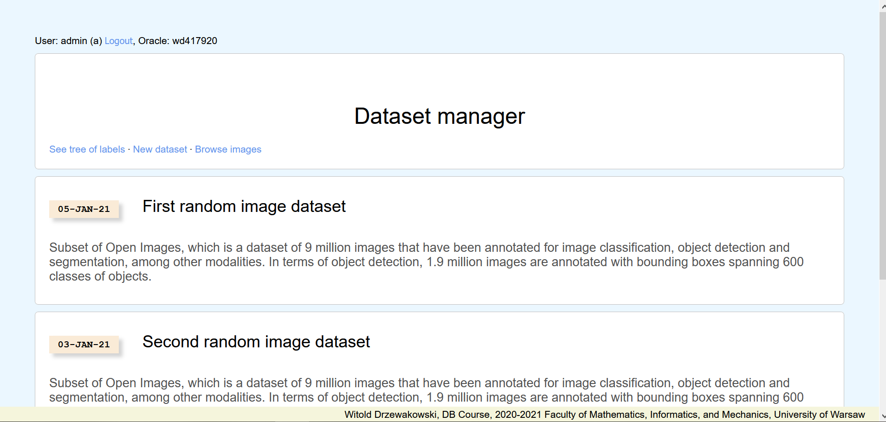
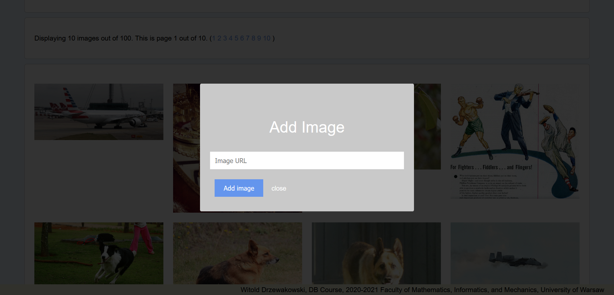
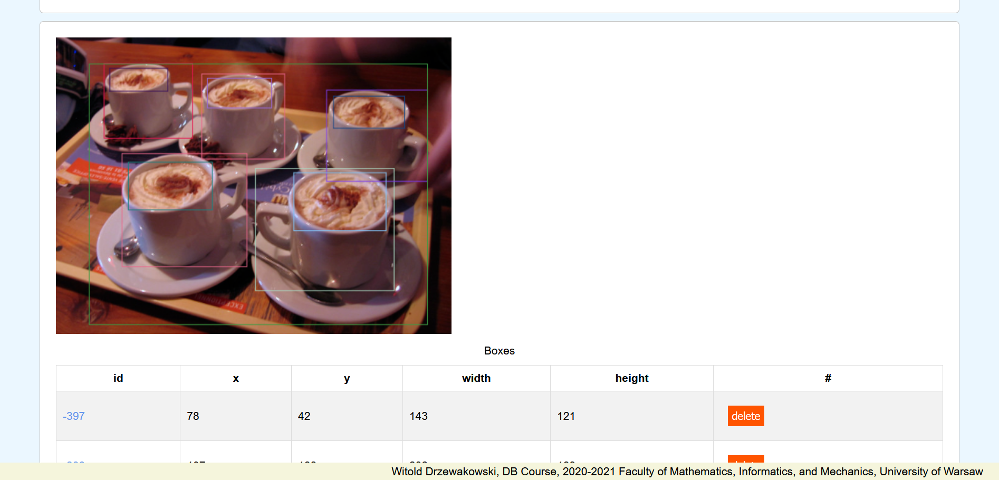
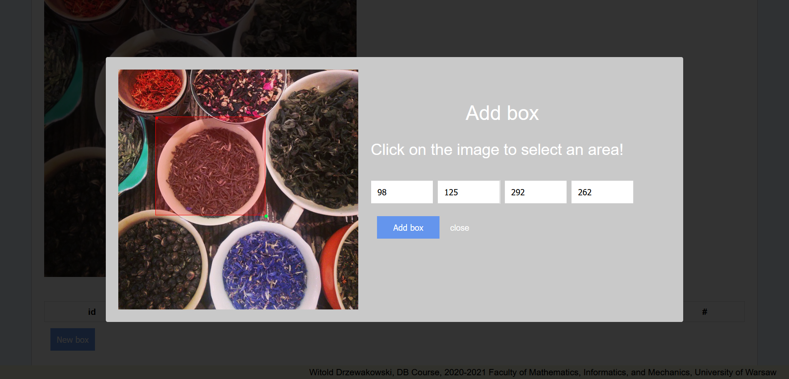
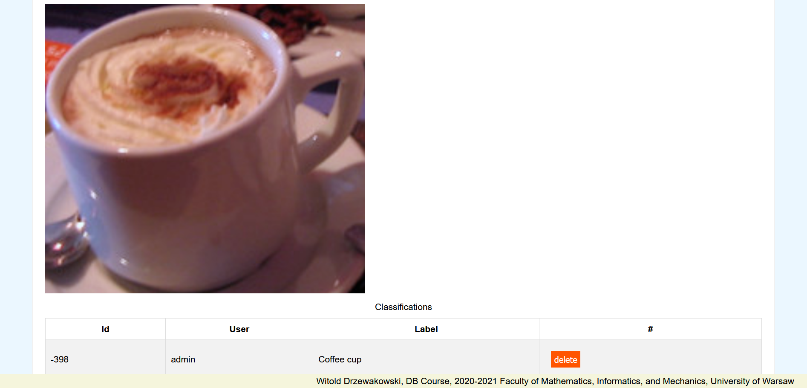

# DB course project
## Introduction
This application is a image dataset manager. Its puproose is to upload, delete, display and download image datasets, as well as inserting and reviewing classifications. Project is written mostly in PHP and large part of it is JavaScript. Apart of this there are stylesheets (CSS), Python code in Jupyter notebook to generate .sql script. I am using Oracle database.

## Model
Database contains user credentials, labels, datasets, images, areas of images and classiffications of areas. Users have different roles in the system ordinary users and admins. Different groups have different permissions to perform operations such as viewing, modifying, createing datasets, specifying new areas of existing images, adding images, classifying areas of images.


## Interface
Front page contains a list of existing datasets with their titles, descriptions etc. It also allows to jump to subpages and to login. A login panel is displayed on every page. 



From front page one can jump to page which contains a list of images. The list is paginated. By clicking a big '+' sign, user can open a popup (see image below) (JS, CSS) which contains a form that allows to insert an url to image on the internet that will be added to the database. Such image can be later linked to one or more datasets, by visiting a dataset subpage and filling in a form there. 



There is a subpage that displays a details of selected image from database. A HTML canvas element was used to draw boxes on top of the image to visually represent areas of the image.



A special interactive tool (JS, CSS) allows user to select a custom area. Click anywhere on the image to select the top-left corner and then the bottom-right corner. Correct values will appear in the form, which a user can submit to add selected box to database.



Boxes can be classified by users. Everyone can see a table that contains a list of classifications. Each user can add such classification. A classification must be a string which has been added to Label table. A list of labels can be browsed through its own specific subpage. Admins can also delete classifications of other users.




## Data
This project uses Oracle database.

### Source
Database contains 100 images divided into 3 datasets.  
This sample data is adapted from __Open Images Dataset__:

<g.co/dataset/open-images>

More specifically, I have downloaded following data
```
classes_2017_11.tar.gz
https://storage.googleapis.com/openimages/2017_11/classes_2017_11.tar.gz

annotations_human_bbox_2017_11.tar.gz
https://storage.googleapis.com/openimages/2017_11/annotations_human_bbox_2017_11.tar.gz

images_2017_11.tar.gz
https://storage.googleapis.com/openimages/2017_11/images_2017_11.tar.gz
```

I have adapted this data using [this notebook](data/dataformatting.ipynb).
The same notebook can be used to adapt pieces of original dataset.

### Generated files
File `create.sql` contains desription of tables, `combined_data.sql` contains sample data, origin oof which I described before.

---

2020-2021 Faculty of Mathematics, Informatics, and Mechanics, University of Warsaw